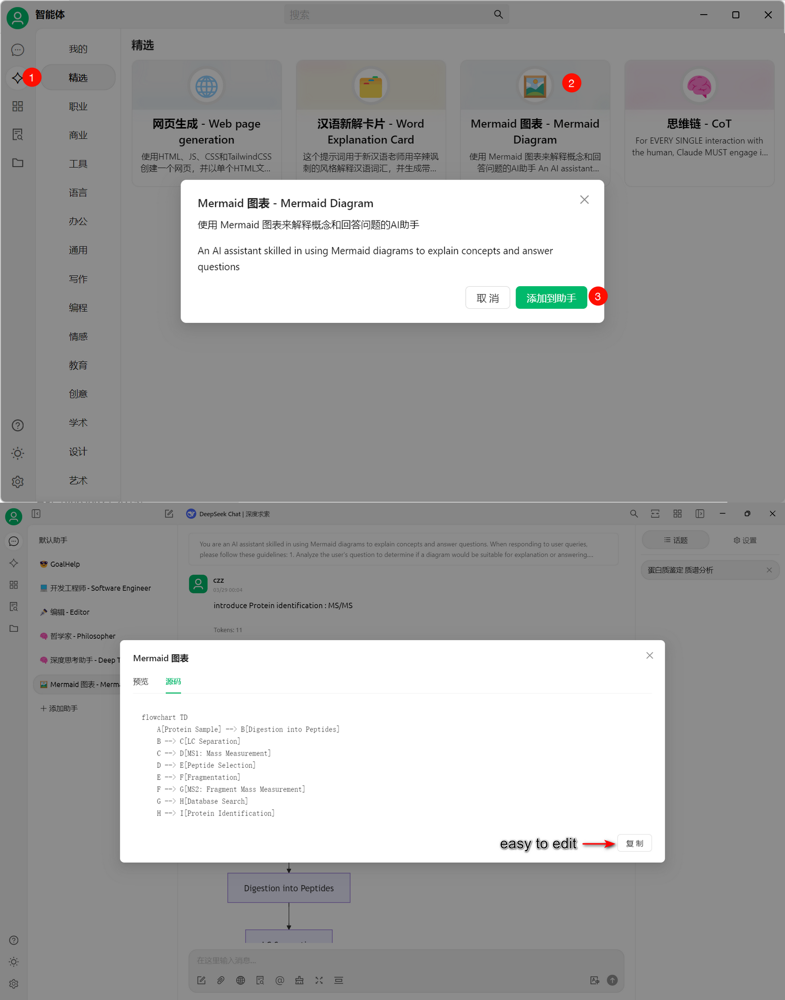
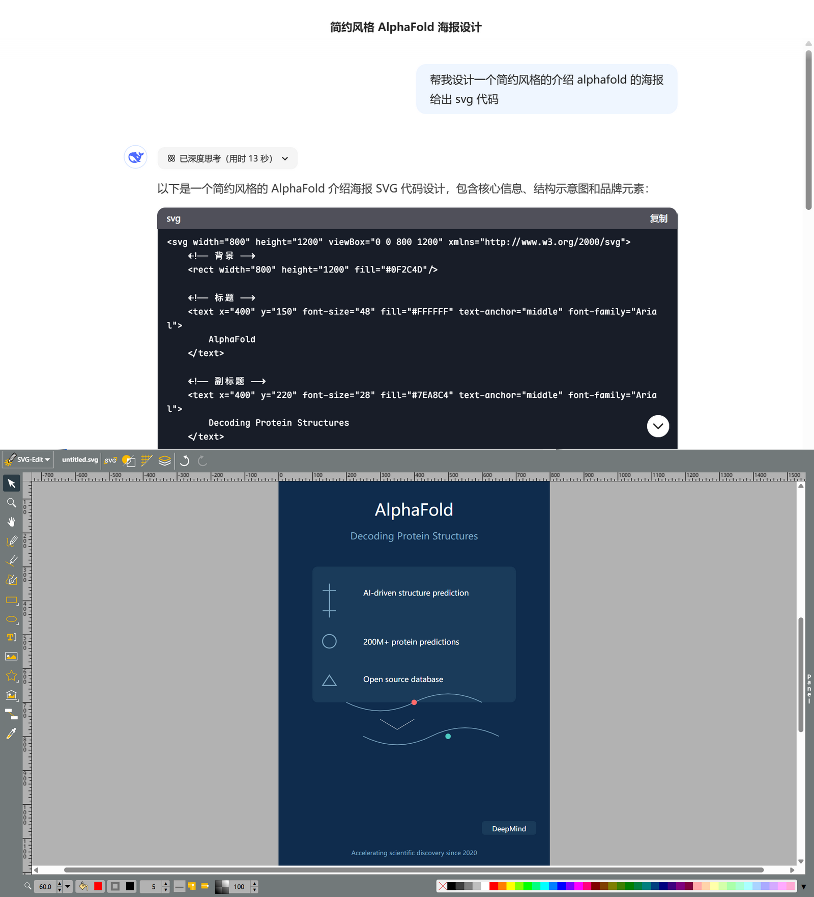
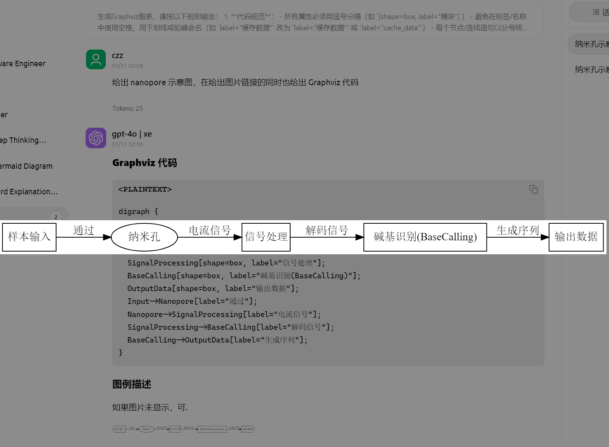
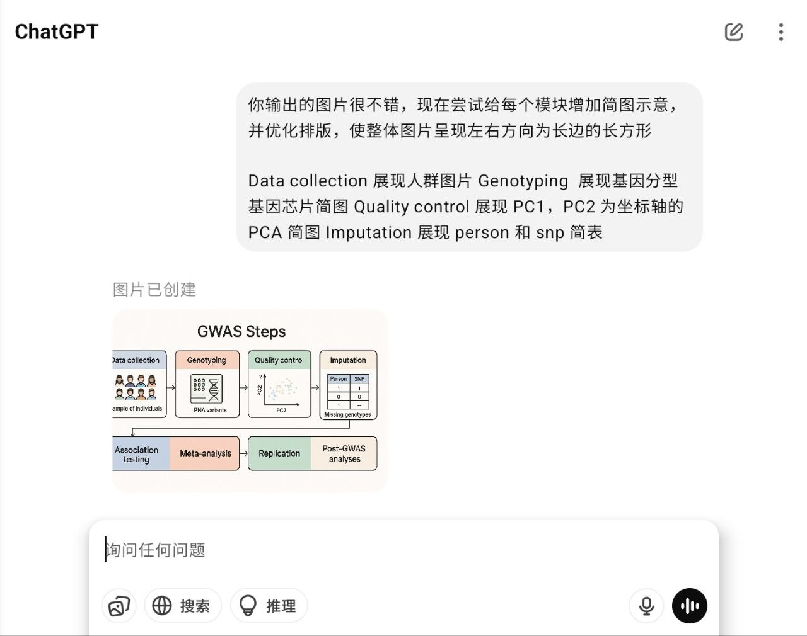
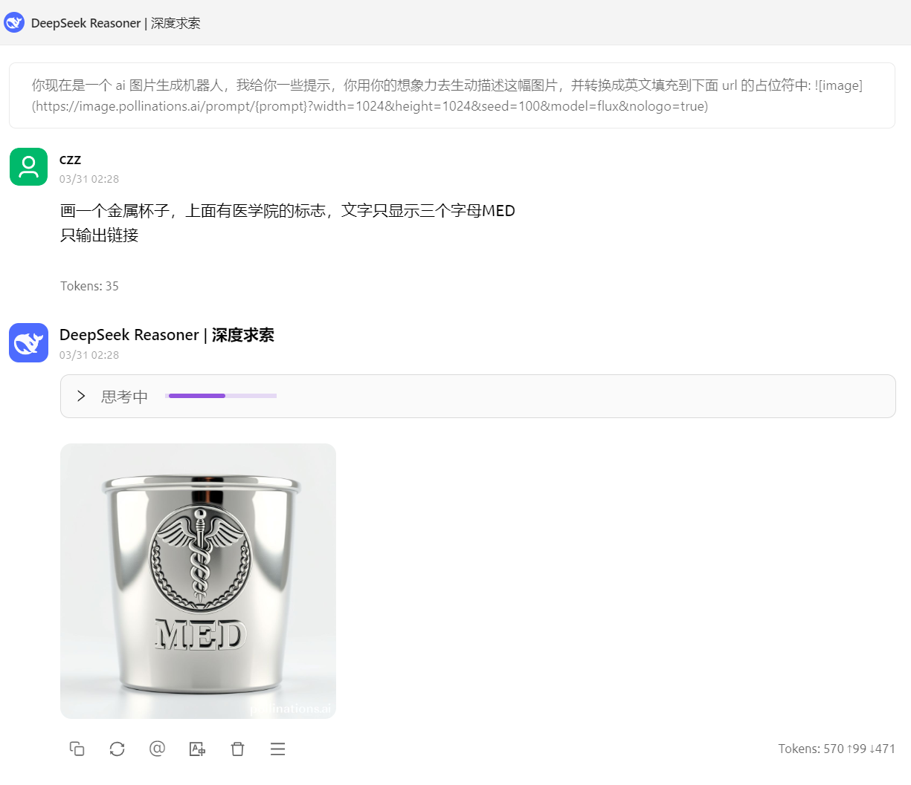

# 我的AI分享

## 目录
1. [一些 AI 相关知识介绍](#一些ai相关知识介绍)
2. [免费使用建议](#免费使用建议)
3. [付费建议](#付费建议)
4. [个人推荐](#个人推荐)
5. [AI 制图](#ai制图)

## 一些ai相关知识介绍

浅显易懂的DeepSeek R1科普文： <https://mazzzystar.com/2025/01/30/chatgpt-to-deepseek-r1-zh/> <br>
B站技术爬爬虾：<https://space.bilibili.com/316183842/upload/video> <br>
B站港中文李老师的科普视频：<https://space.bilibili.com/605551118/upload/video> <br>
wx公众号：浮之静 ；李继刚 <br>
如何写prompt： <https://github.com/lencx/Noi/blob/main/resources/pdf/Google_Prompt_Engineering_v7.pdf> <br>

## 免费使用建议

我的硅基流动邀请链接（邀请赠送14元平台配额）： <br>
<https://cloud.siliconflow.cn/i/50jmddg2> <br>

GitHub学生包教程（可在 vscode GitHub copilot 使用辅助编程）： <br>
<https://zhuanlan.zhihu.com/p/578964972>  <br>

## 付费建议

什么时候需要付费？为什么要付费？为什么选择中转站付费？ <br>
1. 直连，付款相对方便，一定程度上避免封号风险（尤其是openai） <br>
2. 商用避免“降智” （尤其是openai） <br>
3. 支持在其他软件中调用ai的能力（翻译，润色，代码辅助，概括文章…） <br>

付费中转站1:<https://burn.hair/> <br>
（Azure openai ，使用GitHub账户登录） <br>
文档：<https://github.com/BurnHair/docs> <br>

付费中转站2:<https://api.oaipro.com/> <br>
（官方openai，官方claude，使用GitHub账户登录，单次充值额度要求较高） <br>
文档：<https://docs.oaipro.com/> <br>

api用在哪？ <br>
可参考deepseek官方建议：<https://github.com/deepseek-ai/awesome-deepseek-integration/blob/main/README_cn.md> <br>

## 个人推荐

我在用的： <br>
Cherry studio (Windows/Mac/Linux)：<https://github.com/CherryHQ/cherry-studio> <br>
chatGPTBox (浏览器插件): <https://github.com/josStorer/chatGPTBox> <br>
kiss-translator (浏览器翻译插件)：<https://github.com/fishjar/kiss-translator> <br>
PDFMathTranslate (pdf论文翻译): <https://github.com/PDFMathTranslate/PDFMathTranslate-next> <br>
gpt-assistant-android (Android): <https://github.com/Skythinker616/gpt-assistant-android> <br>
DictTango (Android e-dictionary): <https://github.com/Jimex/DictTango-Android> <br>

我的ai模型推荐： <br>
复杂代码：claude-opus-4.1  ； DeepSeek-V3.1 ; openai o3 <br>
日常对话：gpt-4.1(多模态支持) ; DeepSeek-V3.1 （图片目前只支持ocr识别文字）<br>
翻译：gemini-2.0-flash-lite; DeepSeek-V3.1 <br>

## AI制图
### 可直接编辑

<details>

<summary>Mermaid</summary>

基于 JavaScript 的图表绘制工具，可生成多种类型的图表 <br>
- 优点：使用广泛，可以直接粘贴导入draw.io, iauto等绘图软件进行编辑和保存 <br>
- 缺点：语法严格，ai直接生成的mermaid代码容易有错误 <br>

我的使用体验：可以方便的生成流程图，但常见错误出现在文本部分括号干扰，需要在文本两侧加英文引号 <br>
eg: ai生成`B --> C([Integrative Analysis<br>(miRNA & DNA Methylation)]) `<br>
修改为`B --> C(["Integrative Analysis<br>(miRNA & DNA Methylation)"]) `<br>
语法检测与在线预览：<https://mermaid.live/> <br>

示意图：<br>


Prompt (来自linux.do论坛Monster Dump)：<br>
英文Prompt：<br>
```
Visualization: Enhance understanding by integrating visualization. 
- Use mermaid.js diagram, and it must be ensured that the syntax is correct and verified.
- Additionally the diagram should be clear, easy to understand, and beautiful.
- Choose the type of diagram that is most comprehensible in the context.
- The returned mermaid syntax must follow the following requirements. 
    1. If the node is flowchart node, always use double quotes around nodes (geometric shapes) text. for example: id["text"].
    2. Always use double quotes in flowchart edges (arrows or lines) labels text. for example: |"text"|.
    3. For numbered steps, use (1) instead of 1.
```
中文Prompt：<br>
```
可视化: 通过整合可视化来增强理解能力。
- 要求使用 Mermaid.js diagram, 按需选择图表类型，必须确保语法正确
- 此外图表应该是美观和清晰，易于理解
- Mermaid.js 语法要遵守:
  1. 如果是 flowchart 节点，节点文本总是使用双引号包住：id["节点名称"]；
  2. 如果是 flowchart 节点，边缘标签中总是使用双引号包住：|"标签文本"|；
  3. 对于编号步骤，使用 (1) 而不是 1. 。
```
</details>

<details>

<summary>svg</summary>

SVG stands for Scalable Vector Graphics. <br>
cherry-studio/deepseek官网/claude官网 可以便捷实现svg预览 <br>
Prompt: 微信公众号 李继刚 <br>
在线修改以及导出svg： <https://svgedit.netlify.app/editor/index.html> 

示意图：<br>


</details>

<details>

<summary>Graphviz</summary>

Graphviz是一个由AT&T实验室启动的开源工具包，用于绘制DOT语言脚本描述的图形 <br>
来自linux.do 论坛 Mozi 推荐 <br>
生成复杂流程图不易报错 <br>

示意图：<br>


Prompt:
[mozi](https://www.yeahhe.online/OneDriveShare/%E5%B0%8F%E8%99%8E%E4%BC%9A%E4%BA%AB/%F0%9F%93%9A%E7%94%B5%E5%AD%90%E4%B9%A6/%F0%9F%92%A1AI%E6%8F%90%E7%A4%BA%E8%AF%8D/Graphviz%E5%9B%BE%E8%A1%A8.html) <br>
在线预览编辑和分享: <https://edotor.net/> 

</details>

### 不可直接编辑
<details>

<summary>Openai</summary>

官网 GPT-4o （需要ChatGPT Plus ,免费账户有次数和频率限制） api暂时不可用 <br>
Developers will soon be able to generate images with GPT-4o via the APl, with access rolling out in the next few weeks.

示意图：<br>


可以看出生成一些营销号中无比精致完美的科研图片需要巨量详尽无比的文字描述 <br>
评语：有这功夫你自己都做出来了 <br>

手写笔记风格Prompt (Emad分享):
```
write a monologue of your real thoughts on making everything studio ghibli style in fountain pen blue ink, on it scrawl corrections in marker pen, they are unhinged, there are doodles and weird oddities scrawled, you cut out and stick on lots and lots of photo extracts from magazines to show the point!!! sometimes you write on them too
```
</details>

<details>

<summary>pollinations</summary>

<https://github.com/pollinations/pollinations> <br>

Pollinations.AI is an open-source gen AI startup based in Berlin, providing the most easy-to-use, free text and image generation API available. No signups or API keys required. We prioritize your privacy with zero data storage and completely anonymous usage.

与deepseek结合 （isinry分享）
Prompt：<br>
```
你现在是一个 ai 图片生成机器人，我给你一些提示，你用你的想象力去生动描述这幅图片，并转换成英文填充到下面 url 的占位符中:

```
示意图：<br>


</details>

欢迎大家指正和补充！<br>


