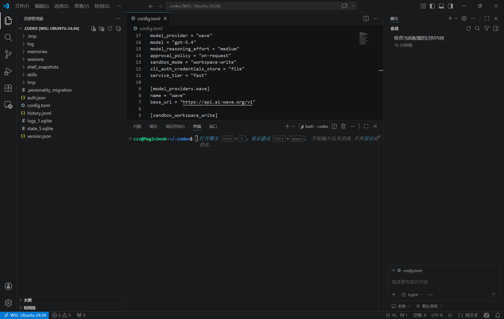
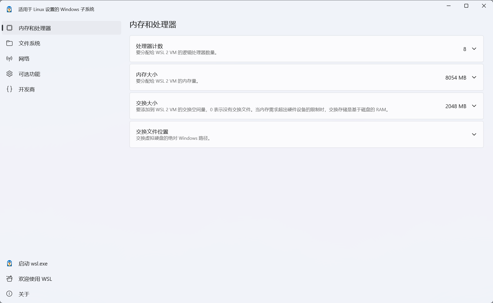
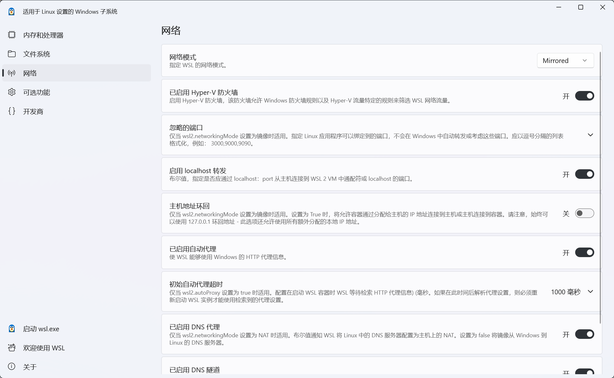
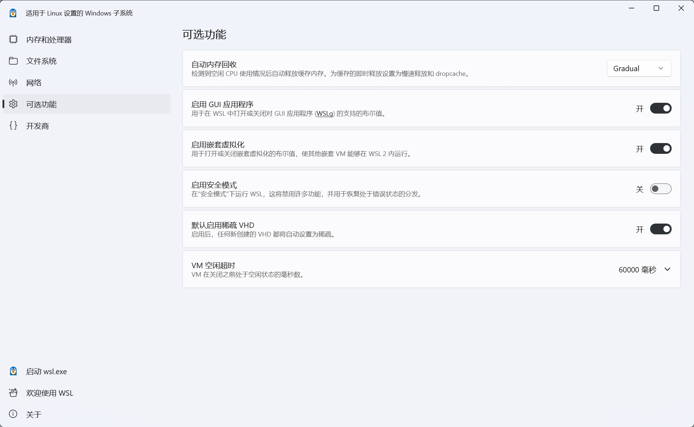
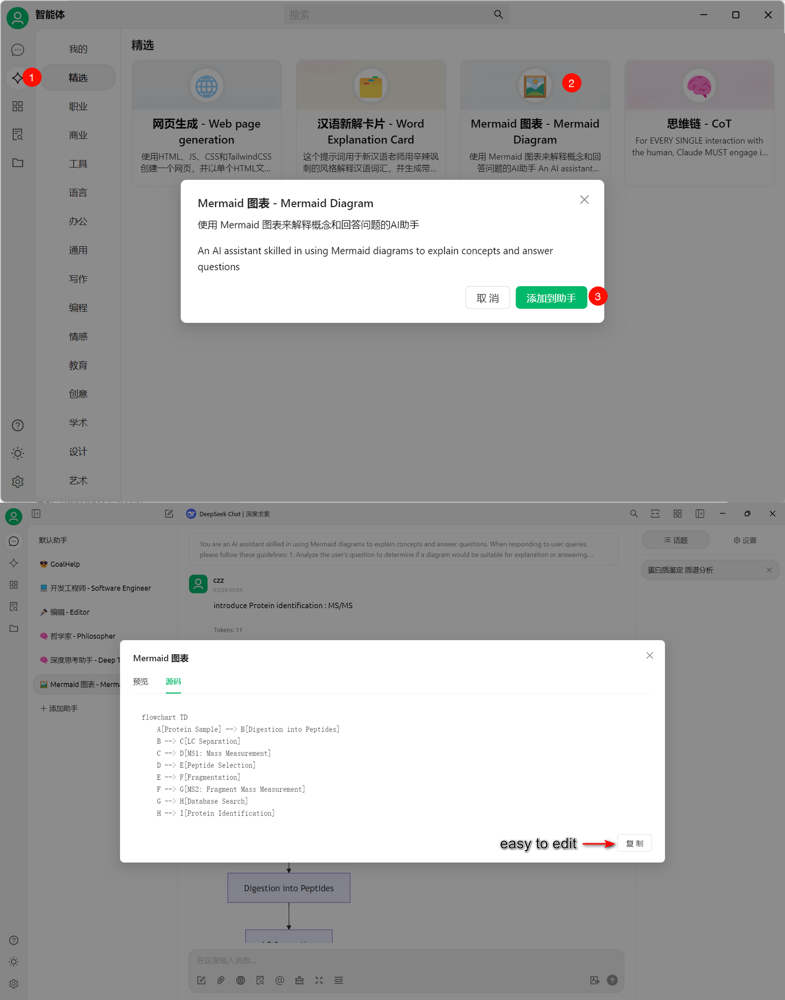
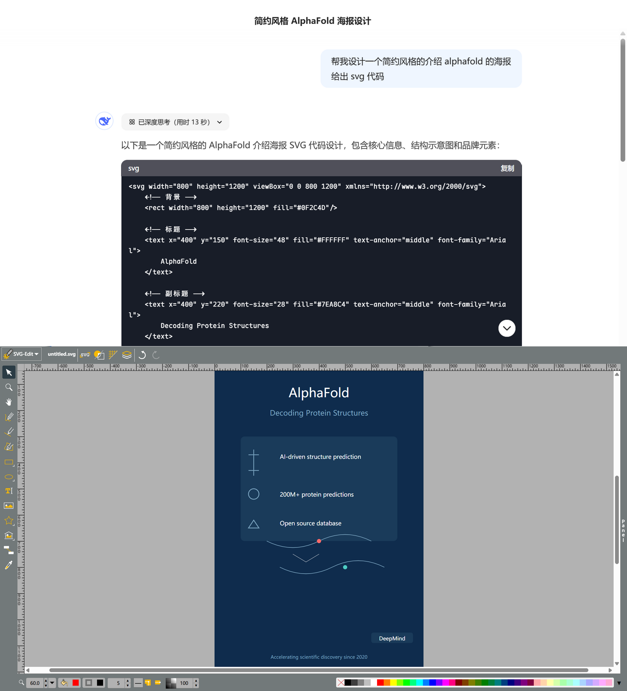
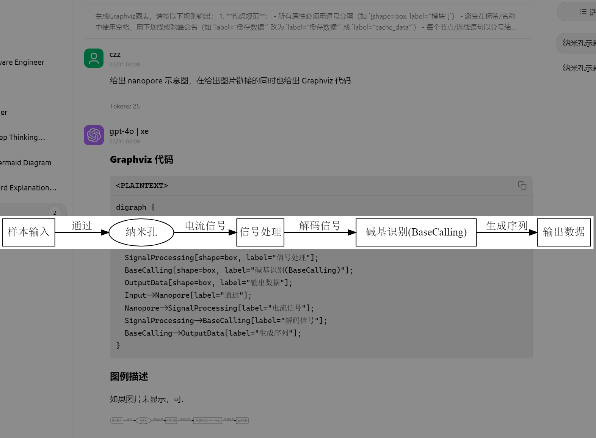

# 我的 AI 分享

## 目录

1. [一些 AI 相关知识介绍](#一些-ai-相关知识介绍)
2. [免费使用建议](#免费使用建议)
3. [付费建议](#付费建议)
4. [个人推荐](#个人推荐)
5. [WSL + Codex CLI（Windows）](#wsl--codex-cliwindows)
6. [AI 制图](#ai-制图)

## 一些 AI 相关知识介绍

- 浅显易懂的 DeepSeek R1 科普文：[ChatGPT to DeepSeek R1（中文）](https://mazzzystar.com/2025/01/30/chatgpt-to-deepseek-r1-zh/)
- B 站技术爬爬虾：[视频投稿页](https://space.bilibili.com/316183842/upload/video)
- B 站港中文李老师的科普视频：[视频投稿页](https://space.bilibili.com/605551118/upload/video)
- 微信公众号：浮之静；李继刚
- 如何写 Prompt：[Google Prompt Engineering v7](https://github.com/lencx/Noi/blob/main/resources/pdf/Google_Prompt_Engineering_v7.pdf)

## 免费使用建议

我的硅基流动邀请链接（邀请赠送 16 元全平台通用代金券）：

- <https://cloud.siliconflow.cn/i/50jmddg2>

GitHub 学生包教程（GitHub Copilot 当前已限制对一线模型的使用，但仍可手动选择 5.3 Codex，仍值得一用）：

- <https://zhuanlan.zhihu.com/p/578964972>

VS Code 在认证 GitHub Education 后，使用 Copilot 插件体验还是不错的。选最好的模型开 Agent 模式确实很爽，但上下文长度相比其他 AI IDE 小不少，这里推荐参考官方文档让 Agent 帮你自动处理：

- <https://code.visualstudio.com/docs/copilot/guides/context-engineering-guide>

## 付费建议

为什么推荐选择中转站付费？

1. 直连，付款相对方便，一定程度上避免封号风险（毕竟封号后很多情况下钱是不退的）。
2. API 属于商用，可一定程度避免网页端“降智”（尤其是 OpenAI）。
3. 支持在提供 API 接口的软件中调用 AI 能力（翻译、润色、代码辅助、概括文章等）。

当然，如果你资金充足，直接官网付费、走 Team 等特殊渠道，或者支持快速迭代的优秀国产模型，也都是很好的选择。

中转站可能掺假或者跑路，请慎重投入资金。以下推荐仅代表本人意见，不为其稳定运行背书。

- OpenRouter：<https://openrouter.ai/>
  - 推荐理由：规模较大，相对可靠。
- AIWave：<https://www.ai-wave.org/>
  - AFF：<https://www.ai-wave.org/register?aff=WArt>
  - 支持：OpenAI、Claude、Gemini
  - 推荐理由：便宜，相对保真。

## 个人推荐

我在用的：

- Cherry Studio（Windows/Mac/Linux）：<https://github.com/CherryHQ/cherry-studio>
- ChatGPTBox（浏览器插件）：<https://github.com/josStorer/chatGPTBox>
- kiss-translator（浏览器翻译插件）：<https://github.com/fishjar/kiss-translator>
- PDFMathTranslate（PDF 论文翻译）：<https://github.com/PDFMathTranslate/PDFMathTranslate-next>
- gpt-assistant-android（Android）：<https://github.com/Skythinker616/gpt-assistant-android>
- DictTango（Android e-dictionary）：<https://github.com/Jimex/DictTango-Android>
- Gety（非常棒的本地文件内容检索 AI 工具）：<https://gety.ai/>
- cc-switch（Claude Code、Codex、Gemini CLI 等 AI 编程工具配置管理）：<https://github.com/farion1231/cc-switch>

我的 AI 模型推荐：

- 复杂代码：Claude Opus 4.6；GPT-5.4；GPT-5.3-Codex
- 日常对话：GPT-5.4；DeepSeek；Qwen3.5系列
- 翻译（经济型优先）：Gemini Flash Lite；DeepSeek；Hunyuan-MT；Qwen-MT
- Office 相关：Kimi K2.5 Agent

## WSL + Codex CLI（Windows）

### 1）先在 Windows 开启 WSL 必要功能（管理员 PowerShell）

```powershell
dism.exe /online /enable-feature /featurename:Microsoft-Windows-Subsystem-Linux /all /norestart
dism.exe /online /enable-feature /featurename:VirtualMachinePlatform /all /norestart
```

执行后先重启一次电脑。

### 2）管理员 PowerShell 一键安装 WSL + Ubuntu

```powershell
wsl --install Ubuntu-24.04 --location D:\WSL\Ubuntu-24.04
```

装完后重启电脑。

如果你这条命令报错（旧版 WSL 不支持 `--location`），先升级再试：

```powershell
wsl --update --web-download
```

### 3）首次进入 Ubuntu（创建用户名和密码）

```powershell
wsl -d Ubuntu-24.04
```

按提示创建 Linux 用户名和密码（输入密码时屏幕不显示是正常的）。

### 4）在 WSL 里准备开发目录

下面命令在 Ubuntu 终端执行：

```bash
mkdir -p ~/code
cd ~/code
```

后续项目都放这里，不要长期放在 `/mnt/c/...` 或 `/mnt/d/...`。

### 5）安装 Codex CLI 运行环境（Node.js + npm）

下面命令在 Ubuntu 终端执行：

```bash
sudo apt update
sudo apt install -y nodejs npm
node -v
npm -v
```

### 6）安装 Codex CLI

下面命令在 Ubuntu 终端执行：

```bash
npm install -g @openai/codex
codex --version
```

### 7）开始使用 Codex CLI

进入你的项目目录后直接运行：

```bash
cd ~/code
codex
```

### 8）VS Code 装插件

在 Windows 版 VS Code 扩展市场安装：

- `WSL`（Microsoft）

然后在 Ubuntu 终端进入项目目录，直接打开：

```bash
cd ~/code
code .
```

第一次会自动安装 VS Code Server。看到左下角是 `WSL: Ubuntu-24.04`（或你的发行版名）就说明成功了。

如果 `code .` 提示命令不存在：在 Windows 里重装/修复 VS Code 时勾选 **Add to PATH**，然后重开终端再试。

这时你可以直接：

- 打开 WSL 里的 Linux 目录文件
- 在 VS Code 内使用 Linux 终端

示意图：



### 9）WSL 设置：用可视化 WSL Settings

直接打开 `WSL Settings` 图形界面修改配置即可。

- 推荐先改这 2 项：
  - `autoMemoryReclaim = gradual`：WSL 空闲时逐步把内存还给 Windows，减少“WSL 吃内存不释放”的体感。
  - `networkingMode = mirrored`：让 WSL 共享 Windows 网络环境，代理 / VPN / 本机回环访问通常更稳定。

改完后在 PowerShell 执行：

```powershell
wsl --shutdown
```

然后重新打开 Ubuntu 即可生效。

示意图：







### 10）Codex CLI 中转站配置（以 AIWave 为例）

下面配置在 WSL 的 Ubuntu 终端里做，不是在 Windows PowerShell 里做。

先编辑用户级配置文件：

```bash
mkdir -p ~/.codex
nano ~/.codex/config.toml
```

可先写成这样：

```toml
model_provider = "wave"
model = "gpt-5.4"
model_reasoning_effort = "medium"
approval_policy = "on-request"
sandbox_mode = "workspace-write"
cli_auth_credentials_store = "file"
service_tier = "fast"
web_search = "live"

[model_providers.wave]
name = "wave"
base_url = "https://api.ai-wave.org/v1"
env_key = "AIWAVE_API_KEY"
```

然后把 AIWave 的 key 放到环境变量里：

```bash
echo 'export AIWAVE_API_KEY="你的 AIWave Key"' >> ~/.bashrc
source ~/.bashrc
```

再运行：

```bash
codex
```

这里有 3 个容易混淆的点：

- `base_url` 只是在告诉 Codex 请求发到哪里，还不等于“已经配置了认证”。
- 如果你像上面这样使用 AIWave 自己的 key，就要补上 `env_key = "AIWAVE_API_KEY"`；否则 Codex 会把这个 provider 当成“无需认证”的自定义 provider，很多情况下会直接 401。
- 如果你的中转站支持 OpenAI 认证而不是它自己的 key，也可以把 `env_key` 改成 `requires_openai_auth = true`，然后用 `codex login` 登录；这两种认证方式二选一即可。

关于“联网搜索是不是这样配置后，输入 key 就可以了”，结论是：

- 只配 `base_url` 再“输入 key”还不够，必须把认证方式也写对。
- Codex 自带的网页搜索和中转站 API 认证不是一回事。按官方文档，`web_search` 默认就是 `cached`；如果想强制用实时网页搜索，可以像上面这样设置 `web_search = "live"`，或者启动时加 `codex --search`。
- 如果你是想让 Codex 在 `workspace-write` 沙箱里执行的命令也能联网（例如 `npm install`、`pip install`、`curl`），那还要再加：

```toml
[sandbox_workspace_write]
network_access = true
```

官方文档：

- Codex Config basics：<https://developers.openai.com/codex/config-basic>
- Codex Authentication：<https://developers.openai.com/codex/auth>
- Codex Configuration reference：<https://developers.openai.com/codex/config-reference>

## AI 制图

### 可直接编辑

<details>

<summary>draw.io MCP</summary>

draw.io 官方发布的 MCP（Model Context Protocol）服务，让 AI 直接生成可编辑的 draw.io 图表。

仓库地址：<https://github.com/jgraph/drawio-mcp>

官方提供三种使用方式：

| 方式 | 说明 | 安装 |
| --- | --- | --- |
| MCP App Server | 图表直接内嵌在对话中渲染 | 无需安装，添加远程 MCP `https://mcp.draw.io/mcp` |
| MCP Tool Server | 在浏览器中打开 draw.io 编辑器 | `npx @drawio/mcp` |
| Project Instructions | 无需 MCP，将提示词粘贴到 Claude Project 中 | 无需安装 |

- 优点：生成的图表可直接在 draw.io 中编辑，支持 XML / CSV / Mermaid 三种输入格式，跨客户端通用（Claude、VS Code 等）。
- 缺点：MCP 方式每次请求携带完整工具描述，Token 消耗较大；Tool Server 需要本地安装 Node.js。

快速开始（以 Claude Desktop 为例）：在 `claude_desktop_config.json` 中添加：

```json
{
  "mcpServers": {
    "drawio": {
      "command": "npx",
      "args": ["@drawio/mcp"]
    }
  }
}
```

也可以不装 MCP，使用官方提供的 [Project Instructions](https://github.com/jgraph/drawio-mcp/tree/main/project-instructions)，将提示词粘贴到 Claude Project，即可通过 Python 代码执行生成 draw.io 链接。

示意图：


</details>

<details>

<summary>Mermaid</summary>

基于 JavaScript 的图表绘制工具，可生成多种类型的图表。

- 优点：使用广泛，可以直接粘贴导入 draw.io、iauto 等绘图软件进行编辑和保存。
- 缺点：语法严格，AI 直接生成的 Mermaid 代码容易出错。

我的使用体验：生成流程图很方便，但常见错误出现在文本部分被括号干扰，需要在文本两侧加英文引号。

例如：

- AI 生成：`B --> C([Integrative Analysis<br>(miRNA & DNA Methylation)])`
- 修改为：`B --> C(["Integrative Analysis<br>(miRNA & DNA Methylation)"])`

语法检测与在线预览：<https://mermaid.live/>

示意图：



Prompt（来自 linux.do 论坛 Monster Dump）：

英文 Prompt：

```text
Visualization: Enhance understanding by integrating visualization.
- Use mermaid.js diagram, and it must be ensured that the syntax is correct and verified.
- Additionally the diagram should be clear, easy to understand, and beautiful.
- Choose the type of diagram that is most comprehensible in the context.
- The returned mermaid syntax must follow the following requirements.
    1. If the node is flowchart node, always use double quotes around nodes (geometric shapes) text. for example: id["text"].
    2. Always use double quotes in flowchart edges (arrows or lines) labels text. for example: |"text"|.
    3. For numbered steps, use (1) instead of 1.
```

中文 Prompt：

```text
可视化: 通过整合可视化来增强理解能力。
- 要求使用 Mermaid.js diagram, 按需选择图表类型，必须确保语法正确
- 此外图表应该是美观和清晰，易于理解
- Mermaid.js 语法要遵守:
  1. 如果是 flowchart 节点，节点文本总是使用双引号包住：id["节点名称"]；
  2. 如果是 flowchart 节点，边缘标签中总是使用双引号包住：|"标签文本"|；
  3. 对于编号步骤，使用 (1) 而不是 1. 。
```

</details>

<details>

<summary>SVG</summary>

SVG stands for Scalable Vector Graphics。

Cherry Studio / DeepSeek 官网 / Claude 官网可以便捷实现 SVG 预览。

Prompt 来源：微信公众号 李继刚

在线修改以及导出 SVG：<https://svgedit.netlify.app/editor/index.html>

示意图：



</details>

<details>

<summary>Graphviz</summary>

Graphviz 是一个由 AT&T 实验室启动的开源工具包，用于绘制 DOT 语言脚本描述的图形。

来自 linux.do 论坛 Mozi 推荐，生成复杂流程图不易报错。

示意图：



Prompt：

- [Mozi](https://www.yeahhe.online/OneDriveShare/%E5%B0%8F%E8%99%8E%E4%BC%9A%E4%BA%AB/%F0%9F%93%9A%E7%94%B5%E5%AD%90%E4%B9%A6/%F0%9F%92%A1AI%E6%8F%90%E7%A4%BA%E8%AF%8D/Graphviz%E5%9B%BE%E8%A1%A8.html)

在线预览、编辑和分享：<https://edotor.net/>

</details>

### 不可手动编辑

<details>

<summary>gpt-image / Google nanobanana / PaperBanana...</summary>

PaperBanana：Automating Academic Illustration for AI Scientists

- <https://dwzhu-pku.github.io/PaperBanana/>

示意图：


手写笔记风格 Prompt（Emad 分享）：

```text
write a monologue of your real thoughts on making everything studio ghibli style in fountain pen blue ink, on it scrawl corrections in marker pen, they are unhinged, there are doodles and weird oddities scrawled, you cut out and stick on lots and lots of photo extracts from magazines to show the point!!! sometimes you write on them too
```

</details>

<details>

<summary>pollinations</summary>

仓库：<https://github.com/pollinations/pollinations>

Pollinations.AI is an open-source gen AI startup based in Berlin, providing the most easy-to-use, free text and image generation API available. No signups or API keys required. We prioritize your privacy with zero data storage and completely anonymous usage.

与 DeepSeek 结合（isinry 分享）

Prompt：

```text
你现在是一个 AI 图片生成机器人，我给你一些提示，你用你的想象力去生动描述这幅图片，并转换成英文填充到下面 URL 的占位符中:

```

示意图：


</details>

欢迎大家指正和补充！
